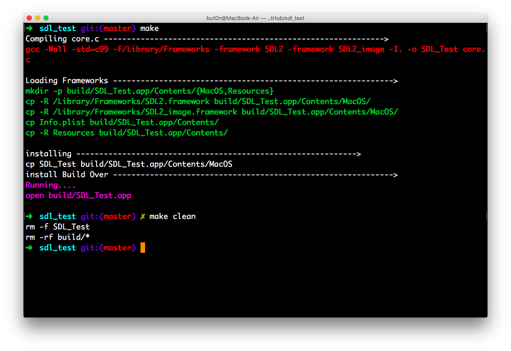

# SDL_make

A simple way to explore SDL without Xcode, only makefile!

- Why not Xcode?

As you know, Xcode is a powerful IDE, it allow you to build some amazing software,
but with Makefile, you will have more control over the build process and to remove the magical blackbox model of compiling that and integrated IDE imposes.
Besides, sometimes you needn't use a huge IDE.

### DEMO

